# Moving Target Indication techniques for Ti FMCW radar

We implement moving target indication (MTI) filter to detect moving target including human and small ball. The mti techniques that we used were referred by Matthew Ash et. al,in the paper named "On Application of Digital Moving Target Indication Techniques to Short-Range FMCW Radar Data".

## Type of MTI

>there are 4 type of MTI in this paper

- Background subtraction with updating background every 0.1 second
- Stove technique (First order FIR filter)
- High pass FIR filter
- High pass IIR filter

The experiment consists of 3 tasks as shown in gif below. First is a human slow walking, Second is a human fast walking, Third is a small ball moving.  

   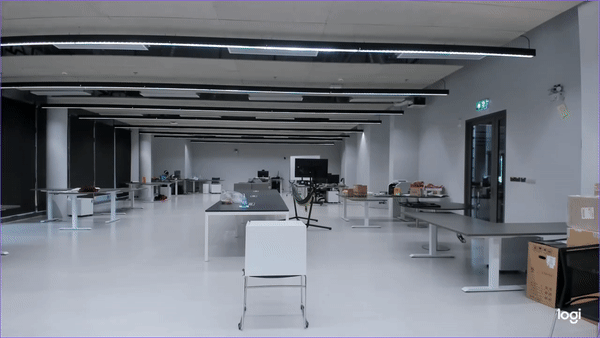 

**Note** - **radar-config** : 300MHz slope, 200 adc samples (left) 66.626MHz slope, 1000 adc samples (right) 

## 1. Background subtraction  

>Human walking (slow) 

- range - time  
  
    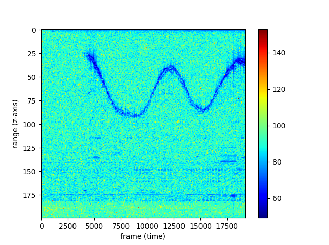 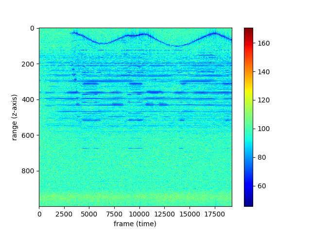

>Human walking (fast)

- range - time  

    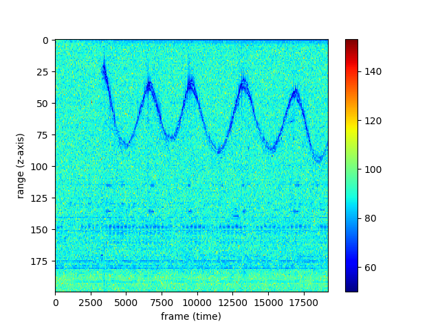 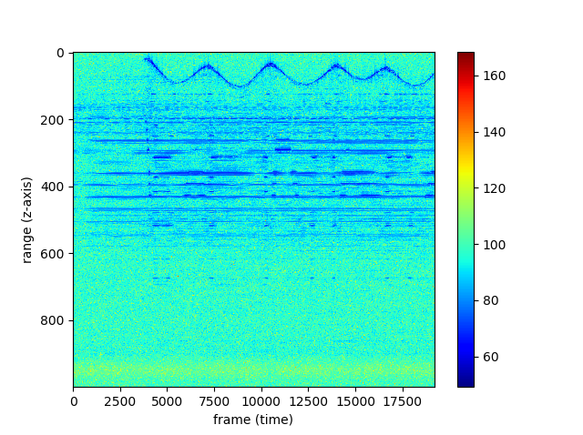

## 2. Background subtraction (with updating background)

>Human walking (slow)

- range - time  
    
    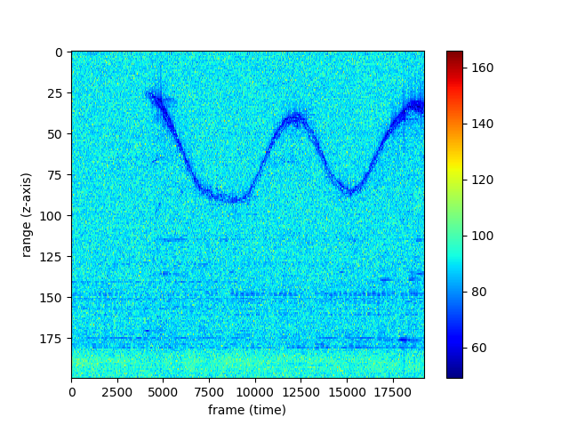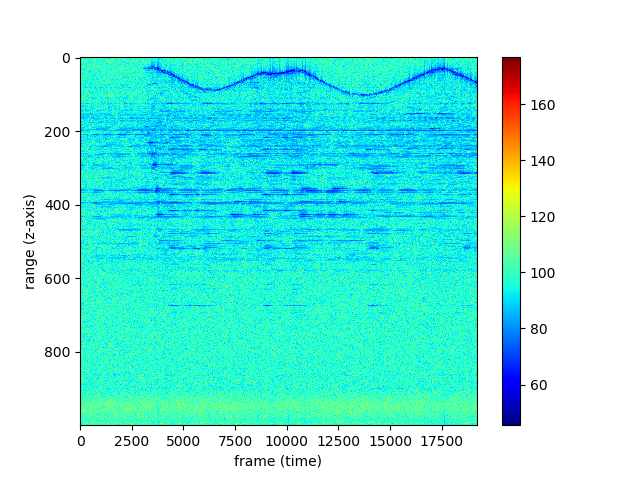

>Human walking (fast)

- range - time  

    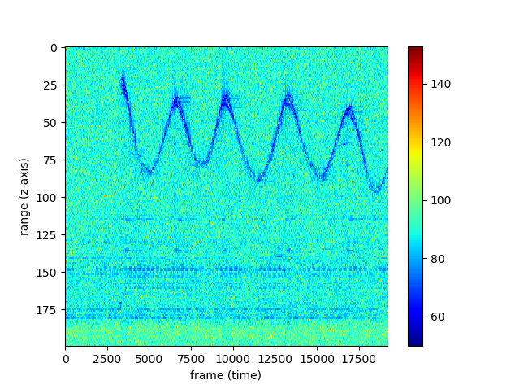 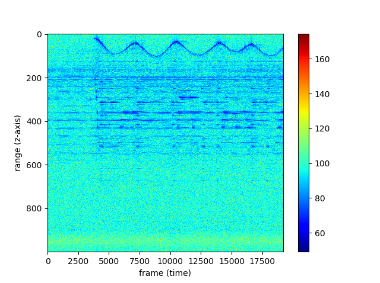

## 3. Stove technique (First order FIR filter)

>Human walking (slow)

- range - time  
    
    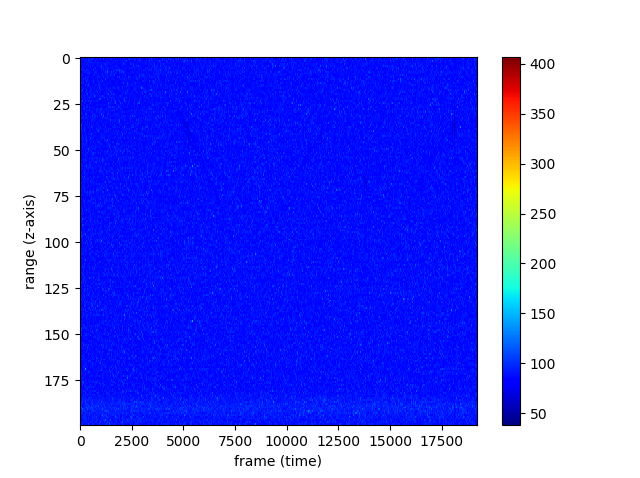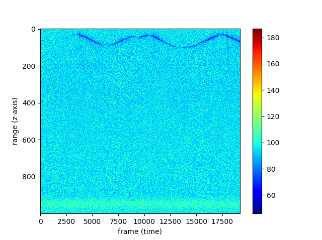

>Human walking (fast)

- range - time  

    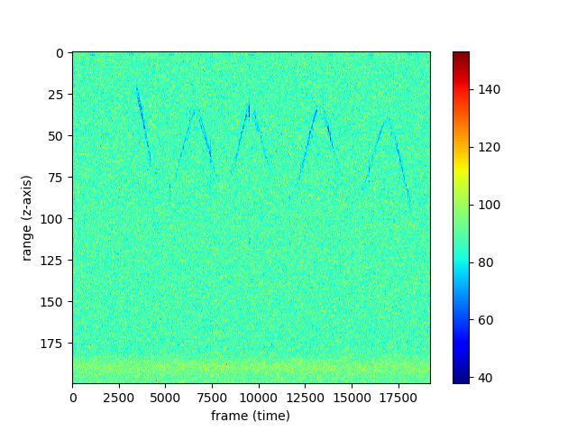 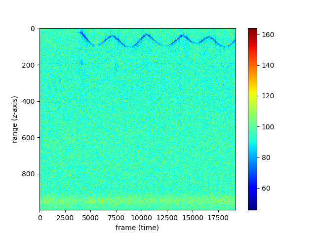

## 4. High pass FIR filter

>Human walking (slow)

- range - time  
    
    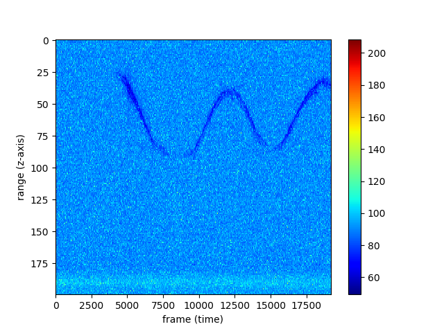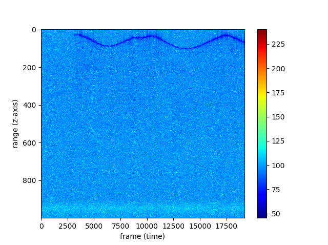

>Human walking (fast)

- range - time  

    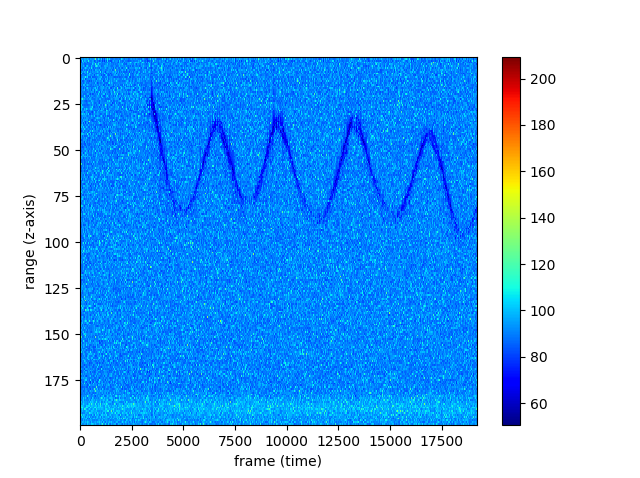 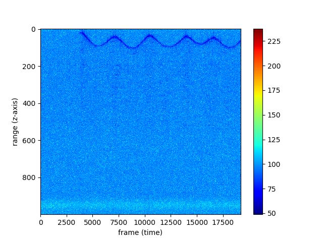

## 5. High pass IIR filter

>Human walking (slow)

- range - time  
    
    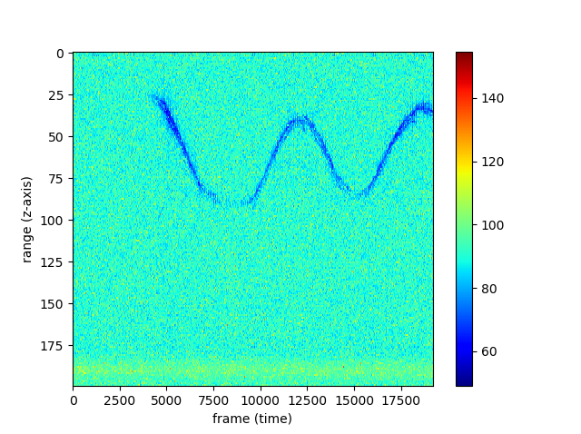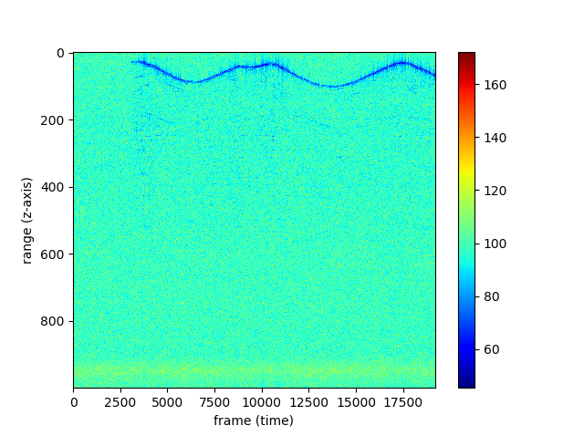

>Human walking (fast)

- range - time  

    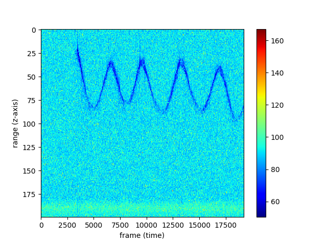 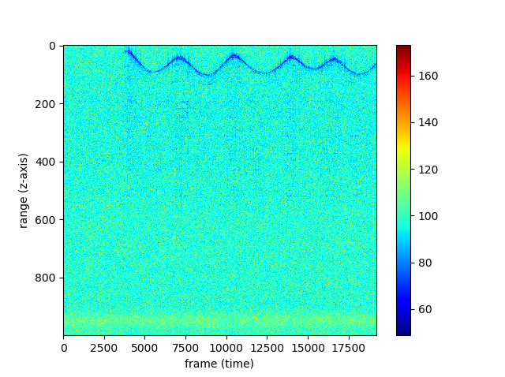

   

# Doppler - range image of each experiment